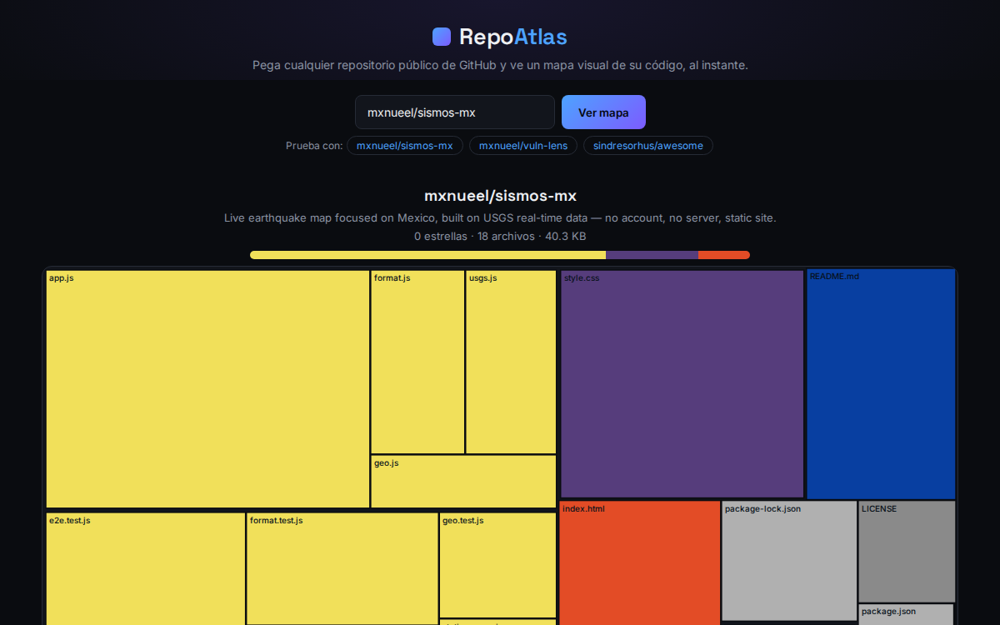

# Repo Atlas

[](https://github.com/mxnueel/repo-atlas/actions/workflows/ci.yml)
[](https://github.com/mxnueel/repo-atlas/actions/workflows/deploy.yml)
[](LICENSE)

**Live: [mxnueel.github.io/repo-atlas](https://mxnueel.github.io/repo-atlas/)**



Paste any public GitHub repository and instantly see a visual map of its codebase — which folders hold the most code, what languages dominate, at a glance. No account, no server, static site.

## Why this instead of CodeSee or Sourcegraph

Understanding an unfamiliar codebase's shape usually means clicking through folders one at a time. Paid products have been built specifically to solve this — CodeSee raised funding and was acquired by GitKraken; Sourcegraph, an enterprise code-intelligence platform, charges around $16k/year and killed its free tier in 2025. Both are proof that "see the shape of the code before you read it" is worth paying for. Repo Atlas is a free, single-purpose, zero-setup version of that one specific idea.

## How it works

1. Fetches the repo's full file tree in one call via GitHub's Git Trees API (`recursive=1`) — every file's path and byte size, no cloning.
2. Builds a nested hierarchy from the flat file list (folders aggregate their children's sizes automatically).
3. Renders it as a [D3.js](https://d3js.org/) treemap: each rectangle is a file, sized by bytes, colored by language/extension.
4. Also pulls GitHub's own per-language byte breakdown for the summary bar, and basic repo stats (stars, description).

Everything runs in your browser — the only network calls are to GitHub's public REST API, which supports public repos with no authentication (60 requests/hour per visitor, plenty for casual use).

## Try it

Open the [live site](https://mxnueel.github.io/repo-atlas/) and paste any public repo — `owner/repo` or a full URL. A few of this portfolio's own repos are one click away as examples.

## Run locally

No build step needed:

```bash
python3 -m http.server 8000
# or: npx serve
```

## Testing

```bash
npm install
npx playwright install chromium
npm test
```

21 tests across three levels:
- **`treemap.test.js`** — pure hierarchy-building, byte aggregation, and color-mapping logic
- **`github.test.js`** — real calls against the live GitHub API (no mocks): fetches this project's own sibling repos, and confirms a clear error for a repo that doesn't exist
- **`e2e.test.js`** — a real headless Chromium browser (Playwright) loading the actual page: confirms the treemap renders real cells for a real repo, switching repos updates it, an invalid repo shows a clear error, and there are zero console errors

CI runs the full suite (including the browser tests) on every push. A separate workflow deploys straight to GitHub Pages on every push to `master`.

## License

MIT — see [LICENSE](LICENSE).
